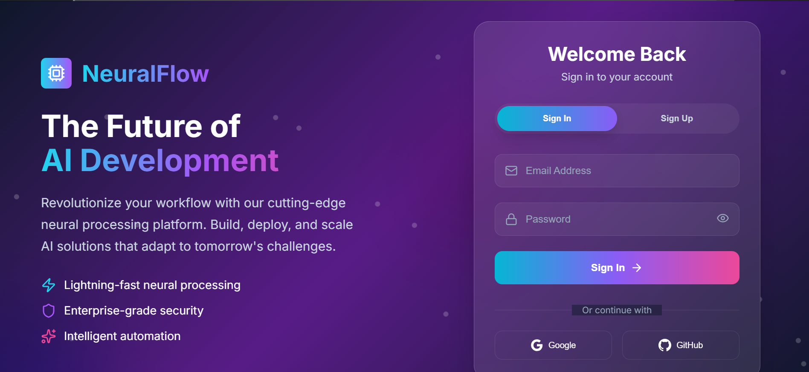

# 🚀 AI Integration Dashboard

A full-stack React application that allows users to securely connect third-party services like **Pipedrive** using API keys and integrate them with **n8n automation workflows**.

---

## 📌 Features

* 🔐 User Authentication (Firebase)
* 📊 Dashboard after login
* 🔑 Secure API key submission (Pipedrive)
* 🗄️ Store user data using Supabase
* ⚙️ Integration-ready with n8n workflows
* 🧠 AI-powered app structure (generated & customized)

---

## 🛠️ Tech Stack

* **Frontend:** React.js
* **Authentication:** Firebase Auth
* **Database:** Supabase
* **Automation:** n8n (manual)
* **Styling:** CSS

---

## ⚙️ How It Works

1. User signs up / logs in
2. Redirected to dashboard
3. Selects **Pipedrive Integration**
4. Follows instructions to generate API key
5. Submits API key
6. Key is stored securely in database
7. Used later in n8n workflows for automation

---

## 📁 Project Structure

```
src/
│── components/
│── pages/
│── App.js
│── index.js
│── styles/
```

---

## 🚀 Getting Started

### 1. Clone the repository

```
git clone https://github.com/iamzeeshan6/Ai-Integration-Dashboard.git
```

### 2. Install dependencies

```
npm install
```

### 3. Run the app

```
npm start
```

---

## 🔐 Environment Variables

Create a `.env` file and add:

```
REACT_APP_FIREBASE_API_KEY=your_key
REACT_APP_SUPABASE_URL=your_url
REACT_APP_SUPABASE_KEY=your_key
```

---

## 📸 Screenshots



---

## 🎯 Future Improvements

* Add more integrations (HubSpot, Stripe, etc.)
* Role-based access control
* API key encryption
* UI/UX improvements

---

## 🤝 Contributing

Contributions are welcome! Feel free to fork this repo and submit a pull request.

---

## 📄 License

This project is open-source and available under the MIT License.

---

## 👨‍💻 Author

Muhammad Zeeshan
Full Stack Developer | AI Enthusiast

---
